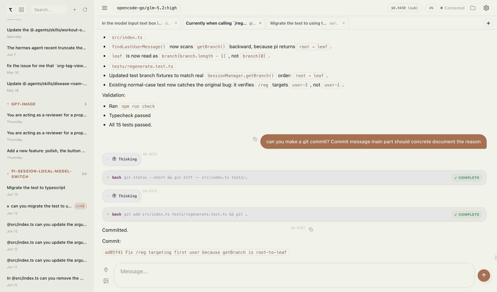
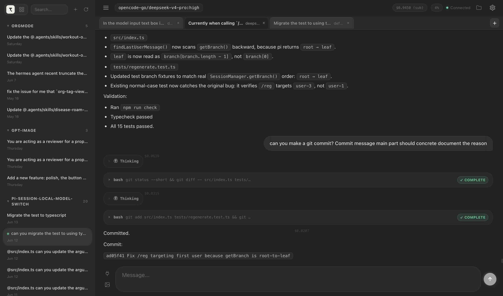
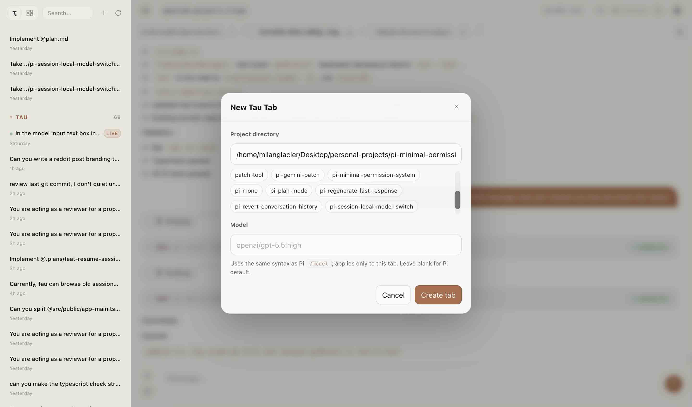
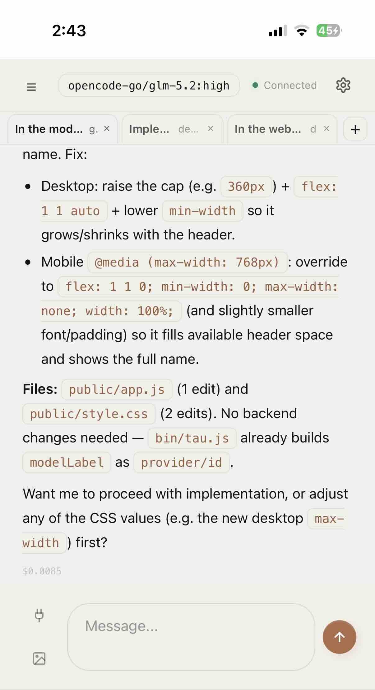

# Pi Tau Web Server

**Browser workspace for [Pi](https://github.com/milanglacier/pi-tau-web-server) — a standalone web server that manages multiple live Pi RPC sessions in parallel.**

Pi Tau Web Server is a fork of [deflating/tau](https://github.com/deflating/tau), forked at
[`5e2bce39`](https://github.com/deflating/tau/tree/5e2bce39) and rewritten from
a Pi extension that ran inside the Pi TUI into a standalone Node.js web server.
Instead of living inside a TUI session, Tau runs one backend process and spawns
headless `pi --mode rpc` child processes — one per in-page Tau tab — so you can
work with multiple Pi sessions side by side in your browser.

## Key differences from `5e2bce39`

| Area | Upstream (`5e2bce39`) | This fork |
|---|---|---|
| **Architecture** | Pi extension loaded inside the Pi TUI process; browser mirrors a single TUI session | Standalone Node.js server that spawns independent `pi --mode rpc` child processes |
| **Multiple sessions** | One browser page, one Pi session — the mirror of whatever the TUI was doing | In-page tabs each backed by their own Pi RPC subprocess; run N sessions in parallel |
| **Session lifecycle** | Tied to the Pi TUI session — close the TUI and the mirror died | Sessions are server-owned; closing/reloading the browser does not kill Pi children |
| **Pi communication** | In-process Pi extension API | Out-of-process JSON line-delimited RPC over stdin/stdout |
| **Test coverage** | No tests | Full test suite |
| **Auto-start** | Extension auto-started inside Pi unless `TAU_DISABLED=1` | Always explicit — the user runs `pi-tau-web-server` when they want it |
| **Multi-device** | Limited — HTTP server but only one session | Open from any device — all clients share the same live session pool |











## What it does

- **Standalone server** — run `pi-tau-web-server`; it serves the web UI and manages Pi RPC child processes as subprocesses via `pi --mode rpc`
- **Multiple live sessions** — in-page Tau tabs (not browser tabs) each represent a live Pi RPC session. Create, switch, and close them from one browser page. Tau runs all of them in parallel.
- **Session persistence while the server runs** — closing or reloading the browser does not kill Pi child sessions; only closing an in-page Tau tab or shutting down the Tau server does
- **Works on any device** — open the same Tau server from your phone, tablet, or another monitor
- **Session history browser** — view saved Pi JSONL session files, search across all sessions by message content
- **WebSocket-based client-server architecture** — the browser connects to Tau over HTTP and WebSocket; Tau communicates with Pi processes over JSON line-delimited RPC over stdin/stdout

## Install

```bash
npm install -g git+https://github.com/milanglacier/pi-tau-web-server.git#main
```

## Usage

```bash
pi-tau-web-server
```

Open the printed URL (default `http://localhost:3001`). Click `+` in the tab bar or sidebar to create an in-page Tau tab, choose or type a project directory, optionally enter a Pi `/model`-style model string, then chat.

```bash
pi-tau-web-server --host 127.0.0.1 --port 3001 --open
TAU_PORT=3001 TAU_HOST=0.0.0.0 TAU_PROJECTS_DIR="$HOME/projects" pi-tau-web-server
```

## Features

### Chat

- Full markdown rendering with syntax-highlighted code blocks
- Streaming responses with typing indicator
- Image attachments (paste, drag & drop, or button)
- Copy any message with one click
- Inline diff viewer for edit tool calls
- Message queuing while the agent is working

### Live Session Management

- Backend-owned live Pi RPC sessions, each backed by a `pi --mode rpc` subprocess
- JupyterLab-style in-page Tau tab strip — each tab is an independent Pi session
- Browser reload or reconnect restores live Tau tabs from the backend
- Multiple browser clients see the same live session list
- Historical sessions remain read-only

### Model & Thinking

- Optional model string at session creation using Pi `/model` syntax (e.g. `openai/gpt-5.5:high`)
- Per-session model picker with fuzzy search
- Per-session thinking level controls
- Token usage percentage with context window visualiser
- Cost tracking per session

### File Browser

- Right sidebar rooted at the active live session's working directory
- Navigate directories, open files natively
- Drag files onto the input to insert their path

### Session Browser

- Sidebar with all saved Pi JSONL session files, grouped by project
- Full-text search across all historical sessions with highlighted snippets
- Rename sessions, export to HTML

### Mobile Support

- Slide-over sidebar with swipe-from-edge gesture
- Slimmed header, model picker stays accessible
- Larger touch targets and font sizes optimized for mobile
- Auto-reconnect WebSocket on return from background
- PWA: installable as a standalone app on iOS, Android, and macOS

### Themes

Six built-in themes: Dusk (clean neutral dark, default), Dawn (warm blue dark), Midnight (OLED black), Clean (Apple-style light with cyan-blue accents), Terracotta (warm light), Sage (warm olive-green). All with frosted glass header and input area.

## Configuration

### CLI flags

| Flag                                      |                                                  Description |
| ----------------------------------------- | -----------------------------------------------------------: |
| `--open`                                  |                 Open the URL in the default browser on start |
| `--port` / `TAU_PORT` / `TAU_MIRROR_PORT` |                                Server port (default: `3001`) |
| `--host` / `TAU_HOST`                     |                            Bind address (default: `0.0.0.0`) |
| `--projects-dir` / `TAU_PROJECTS_DIR`     | Directory scanned for project chips in the new-session modal |

### Environment variables

| Variable                       |     Default |                                              Description |
| ------------------------------ | ----------: | -------------------------------------------------------: |
| `TAU_PORT` / `TAU_MIRROR_PORT` |      `3001` |                                              Server port |
| `TAU_HOST`                     |   `0.0.0.0` |                                             Bind address |
| `TAU_PROJECTS_DIR`             |    _(none)_ | Directory scanned for project chips in the new-tab modal |
| `TAU_STATIC_DIR`               | _(bundled)_ |                               Override static files path |
| `TAU_USER`                     |    _(none)_ |                                 HTTP Basic Auth username |
| `TAU_PASS`                     |    _(none)_ |                                 HTTP Basic Auth password |

Tau also reads matching values from `~/.pi/agent/settings.json` under the `tau` key (`host`, `port`, `projectsDir`, `user`, `pass`, `authEnabled`).

### Authentication

Tau Web Server supports optional HTTP Basic Auth. Set credentials in `~/.pi/agent/settings.json` or via environment variables, then toggle "Require login" in Tau Settings.

```json
{
  "tau": {
    "user": "pi",
    "pass": "your-password"
  }
}
```

Both HTTP and WebSocket connections are gated when enabled. `/api/health` remains open for monitoring.

## How it works

```
┌─────────────┐     ┌──────────────────────────┐     ┌───────────────────────────┐
│  Browser    │◄───►│  Tau Web Server          │◄───►│  pi --mode rpc            │
│  (Tau UI)   │     │  HTTP + WebSocket +      │     │  child session 1          │
│             │     │  LiveSessionManager      │     ├───────────────────────────┤
│             │     │  (Node.js)               │     │  pi --mode rpc            │
│             │     │                          │     │  child session 2          │
│             │     │                          │     ├───────────────────────────┤
│             │     │                          │     │  pi --mode rpc            │
│             │     │                          │     │  child session (N)        │
└─────────────┘     └──────────────────────────┘     └───────────────────────────┘
```

The browser connects to Tau Web Server over WebSocket (and HTTP for history and API calls). Tau manages a pool of `PiRpcSession` instances, each of which spawns a `pi --mode rpc` subprocess. Communication with Pi is over JSON line-delimited RPC via stdin/stdout. Closing an in-page Tau tab sends a DELETE request that terminates the corresponding Pi child. Shutting down Tau terminates all managed children.

The deprecated Pi extension (`extensions/mirror-server.ts`) is a no-op that prints a message telling users to run `pi-tau-web-server` from the shell instead.

## Development

### Prerequisites

- [Pi](https://github.com/badlogic/pi-mono) must be installed (`pi` on `PATH`)
- Node.js and npm

### Setup

```bash
git clone https://github.com/milanglacier/pi-tau-web-server.git
cd pi-tau-web-server
npm install
npm run build
npm link
pi-tau-web-server --projects-dir ~/code
```

The project is written in TypeScript, with separate `tsconfig.json` files:

| Config                     |                                       Targets |
| -------------------------- | --------------------------------------------: |
| `tsconfig.server.json`     |     Server-side code (`src/server/` → `bin/`) |
| `tsconfig.public.json`     | Browser-side code (`src/public/` → `public/`) |
| `tsconfig.extensions.json` |                 Pi extensions (`extensions/`) |
| `tsconfig.test.json`       |                          Test files (`test/`) |

Compiled JS is not committed to git (see `.gitignore`). Always run `npm run build` (or `tsc -p <config>`) after editing TypeScript source.

Edit `public/` files and refresh the browser. Restart `pi-tau-web-server` after changing server code in `src/server/`.

### Tests

```bash
npm test
```

The test suite uses Node.js built-in `node --test` and covers session-file path validation, the `PiRpcSession` state machine, `LiveSessionManager`, the `/api/rpc` shim, HTTP + WebSocket server surface (including same-origin/CORS hardening and malformed-URL hardening), and WebSocket auth gating.

Each test file points `PI_CODING_AGENT_DIR` at an isolated temp tree so real Pi settings and sessions are never touched. The `LiveSessionManager` tests replace the real `spawn` with a test stub.

### Project structure

```
├── bin/            # Compiled server-side JS
├── public/         # Compiled browser-side JS, HTML, CSS, icons
├── src/
│   ├── server/     # Server TypeScript source
│   │   ├── server-main.ts   # HTTP server, WebSocket, API routes
│   │   ├── sessions.ts      # PiRpcSession + LiveSessionManager
│   │   ├── model-utils.ts   # Model parsing and formatting
│   │   ├── config.ts        # Settings, paths, CLI args
│   │   └── types.ts         # Shared type definitions
│   └── public/     # Browser TypeScript source
│       ├── app.ts, app-main.ts, state.ts, themes.ts, ...
│       └── websocket-client.ts
├── extensions/     # Pi extensions (deprecated — no-ops)
├── test/           # Node.js test files
├── docs/           # Screenshots and documentation
└── extras/         # Extra utilities
```

## License

MIT
